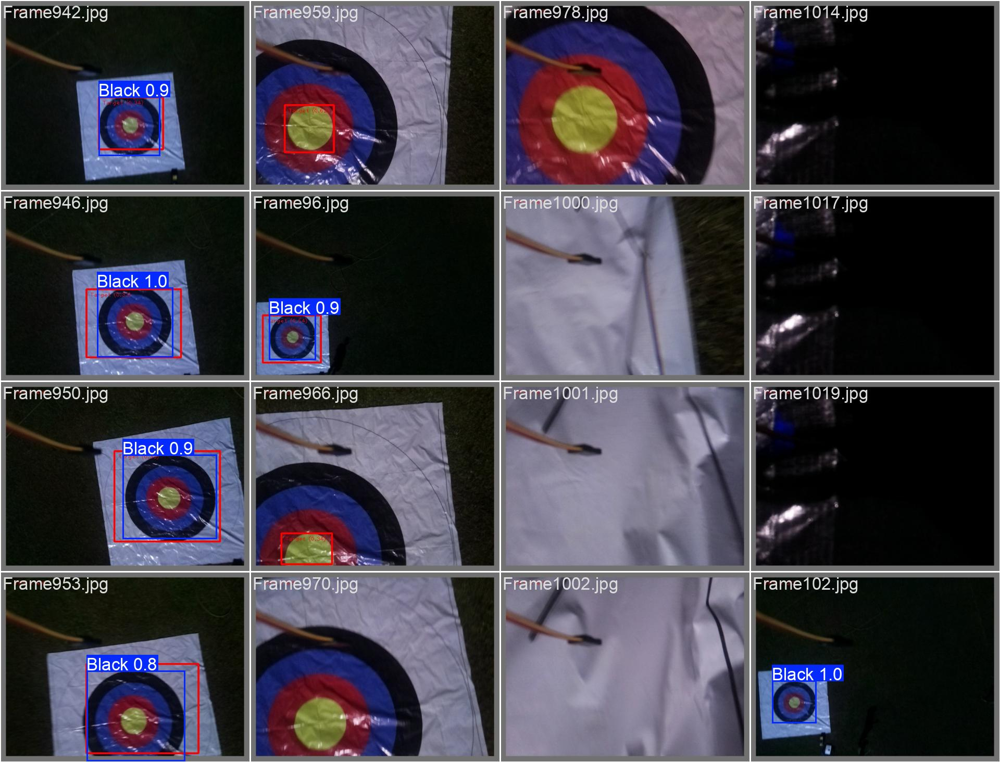

# YOLOv8 Black Object Detection

 
*Sample training batch with annotations*

## 📊 Training Results

### Performance Metrics
| Metric | Chart |
|--------|-------|
| **Precision-Recall** |  |
| **F1 Score** |  |
| **Confusion Matrix** |  |

### Learning Curves
<div align="center">
  
  <p><em>Training metrics over epochs</em></p>
</div>

## 🔍 Validation Samples

### Labeled vs Predicted
| | Labels | Predictions |
|-|--------|-------------|
| **Batch 0** |  |  |
| **Batch 1** |  |  |


## Real-Time Performance


## 📈 Advanced Metrics

<div align="center">
  
  
  <p><em>Left: Label Correlations • Right: Precision Curve</em></p>
</div>

## 🛠️ Training Configuration
```yaml
# Reference: results/black_detection_v1/args.yaml
batch: 16
imgsz: 640
lr0: 0.01
weight_decay: 0.0005
